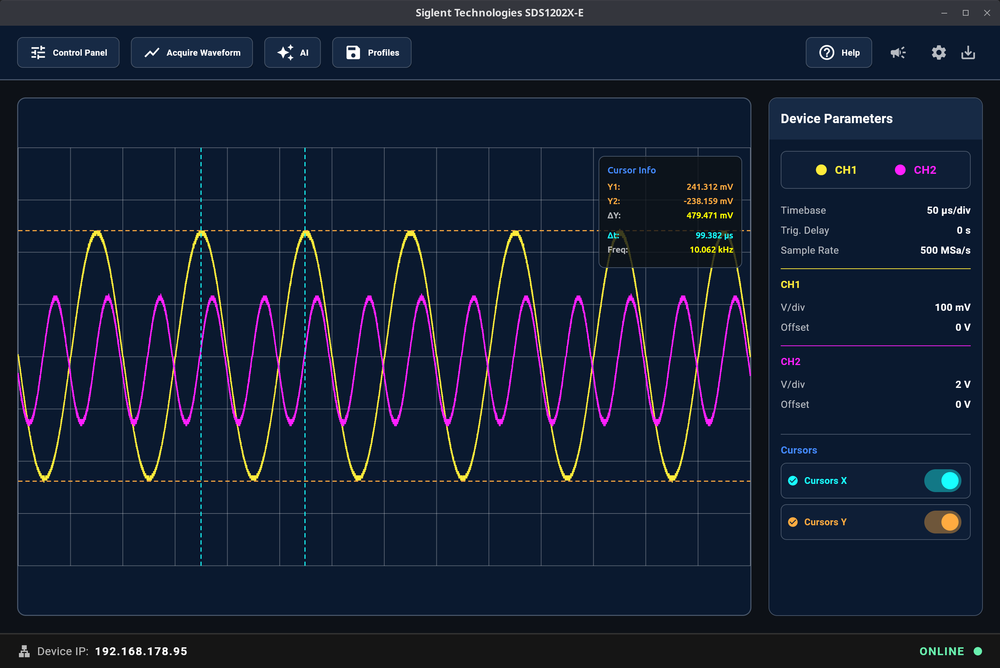
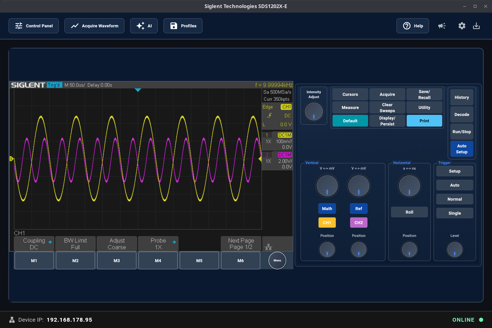
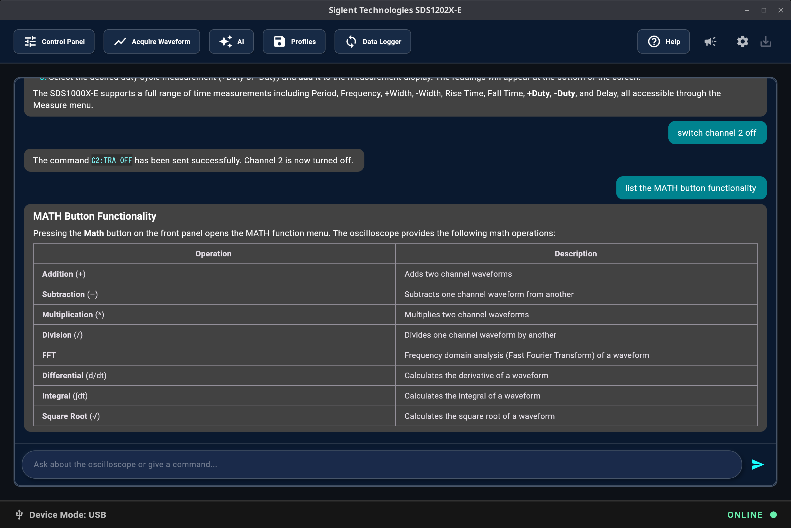
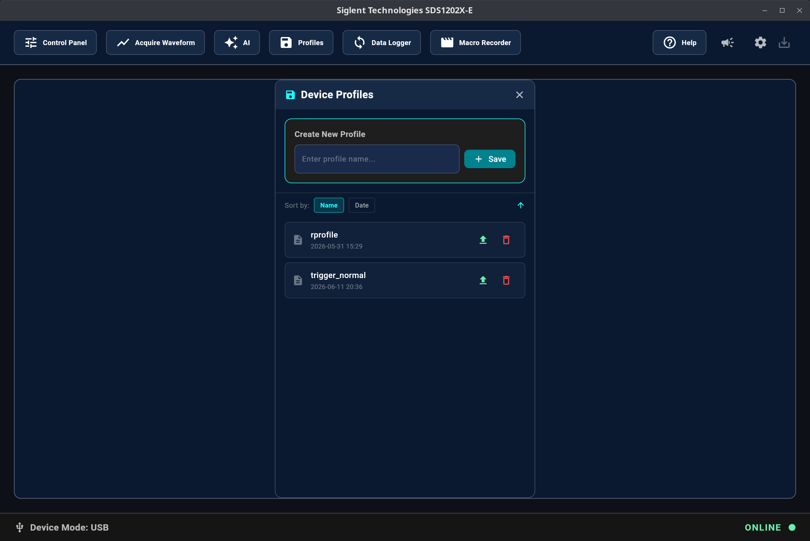

# SDS-Remote

**SDS-Remote** is a remote control interface and help center for Siglent SDS 1000X-E series oscilloscopes. It provides a modern graphical user interface (GUI) for instrument control, waveform acquisition, screen capture, and interaction via an integrated AI-powered chat interface. SDS-Remote runs on **Linux** and **Windows**.

## 1. SDS-Remote Software: What is it for and what can it do

Remote control and AI enhanced operation of Siglent SDS1202X-E, SDS1104X-E, SDS1204X-E and SDS1102X-E oscilloscopes from **Linux** and **Windows**.

### Key Features
- **Remote Oscilloscope Control**: Control your oscilloscope over a network using the VXI-11 protocol.
- **Waveform Acquisition & Data Export**: Capture and display waveform data from enabled channels. Save screen captures as images and export waveform data as CSV files.
  
  
- **Remote Control Panel**: Acquire and view the oscilloscope display. Remote control your oscilloscope with a virtual front panel.
  
  

- **AI Chat Interface**: Send commands and query oscilloscope functionality using natural language.
  
  

- **Device Profile Management**: Save and restore oscilloscope configurations as local files (.lss) for quick setup.
  
  

- **Device Parameter Monitoring**: View real-time parameters such as timebase, sample rate, and voltage settings. Cursor-based measurements are supported.

---

## 2. Installation: 

### 2.1 Linux Debian .deb Package

To install the pre-compiled Debian `.deb` package on Ubuntu (24.04 or newer) or other Debian-based Linux distributions, download the [latest package](https://github.com/klumw/sdsremote/releases/download/0.1.1/sdsremote_0.1.1_amd64.deb) from the releases page and run the following command in your terminal:

```bash
sudo apt install ./sdsremote_0.1.1_amd64.deb
```

Or double click the .deb file and follow the installation instructions.

Once installed, you can launch the application from your desktop environment's application menu.

---

### 2.2 Windows MSI Installer

For installation on Windows use the MSI installer [sdsremote_0.1.1.exe](https://github.com/klumw/sdsremote/releases/download/0.1.1/sdsremote_0.1.1.exe)

---

## 3. Building the Application Yourself

If you prefer to build sdsremote from source, you will need to set up the Flutter SDK and its dependencies.

### 3.1 Installation of Flutter/Dart

Choose the instructions for your target platform:

#### Linux

1. **Install Dependencies**: Ensure you have the necessary development tools installed:
   ```bash
   sudo apt install curl git unzip cmake ninja-build pkg-config libgtk-3-dev
   ```
2. **Download Flutter**: Download the Flutter SDK from the [official Flutter Linux installation guide](https://docs.flutter.dev/get-started/install/linux).
3. **Extract and Add to PATH**: Extract the archive and add the `flutter/bin` directory to your system's PATH.
4. **Verify Installation**: Run `flutter doctor` in your terminal to verify that all dependencies are installed and the environment is set up correctly.

#### Windows

1. **Install Dependencies**: Ensure you have the following installed:
   - [Git for Windows](https://git-scm.com/download/win)
   - [Visual Studio 2022](https://visualstudio.microsoft.com/downloads/) with the **"Desktop development with C++"** workload
2. **Download Flutter**: Download the Flutter SDK from the [official Flutter Windows installation guide](https://docs.flutter.dev/get-started/install/windows).
3. **Extract and Add to PATH**: Extract the archive and add the `flutter\bin` directory to your system's PATH.
4. **Verify Installation**: Run `flutter doctor` in a command prompt to verify that all dependencies are installed and the environment is set up correctly.

### 3.2 Building the App from Source

1. **Clone the Repository** (if not already cloned):
   ```bash
   git clone https://github.com/klumw/sdsremote.git
   cd sdsremote
   ```

2. **Get Packages**:
   ```bash
   flutter pub get
   ```

3.1 **Build the Linux Application**:
   
   ```bash
   flutter build linux
   ```
   The compiled executable will be located in the `build/linux/x64/release/bundle/` directory.

3.2 **Build the Windows Application**:
   ```bash
   flutter build windows
   ```
   The compiled executable will be located in the `build/windows/x64/Runner/Release/release/bundle/` directory.
   To run the exe file you also need the associated DLLs and the data directory in the same folder.

4. **Run the Application**:
   You can run the built executable directly, or run it in debug/development mode:
   
   **Linux**
   ```bash
   flutter run -d linux
   ```
   
   **Windows**
   ```bash
   flutter run -d windows
   ```

> **Note:** The AI functionality requires Docker and a locally running AI server image (`klumw/sds:latest`). Refer to the application's internal documentation for detailed AI setup instructions.

---

## 4. License and Feedback

**License**  
This software is released under the terms and conditions of the [Apache 2.0 License](https://www.apache.org/licenses/LICENSE-2.0.html).

**Feedback and Support**  
- Review the in-app help manual for detailed troubleshooting.
- Check the application logs at `/tmp/sds/logging/sds.log` (Linux) or `%TEMP%\sds\logging\sds.log` (Windows).
- Submit issues or feature requests via the [sdsremote GitHub repository Issues section](https://github.com/klumw/sdsremote/issues).
