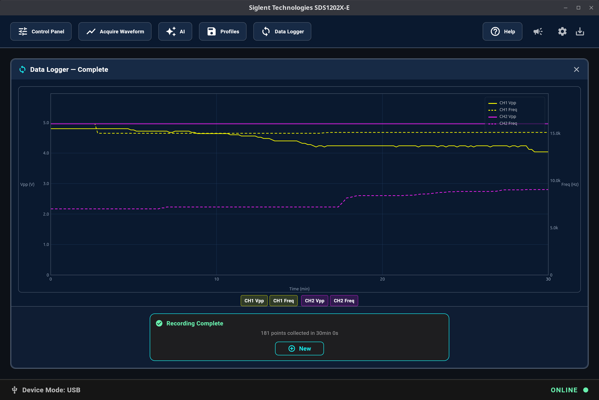
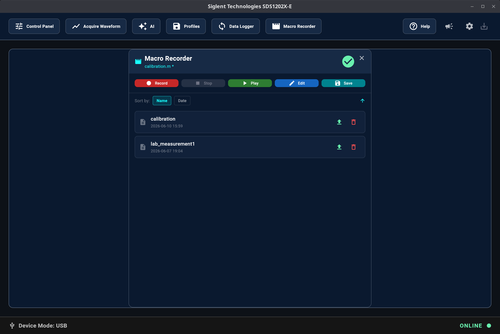

# SDS-Remote

**SDS-Remote** is a remote control interface and help center for Siglent SDS 1000X-E series oscilloscopes. It provides a modern graphical user interface (GUI) for instrument control, waveform acquisition, screen capture, data logging, and interaction through an integrated AI-powered chat interface. SDS-Remote runs on **Linux** and **Windows**.

> **Note:** This application is not affiliated with Siglent or any other commercial entity.

---

## 1. What is SDS-Remote and What Can it Do?

SDS-Remote enables remote control and AI-enhanced operation of Siglent SDS1202X-E, SDS1104X-E, SDS1204X-E, and SDS1102X-E oscilloscopes from **Linux** and **Windows**.

### Key Features

- **Remote Oscilloscope Control**: Control supported oscilloscopes remotely over a network using the VXI-11 protocol or through USB connectivity (USB support is currently experimental).
- **Waveform Acquisition & Data Export**: Capture and display waveform data from enabled channels. Save screen captures as images and export waveform data as CSV files.
- **Device Parameter Monitoring**: View real-time parameters such as timebase, sample rate, and voltage settings. Cursor-based measurements are supported.
- **Data Logging**: Log key data points over a period of time. Generate PDF measurement reports containing charts and key metrics, or export all recorded measurement points as CSV files.
- **Macro Recorder**: Record, edit and play back SCPI command sequences. Supports variables, conditionals, loops, and both network and USB connections for automated test procedures.

### Waveform Data Acquisition

Acquire and visualize waveform data. Perform advanced measurements using X/Y cursors and zoom controls for detailed waveform analysis. Export waveform data as image files or CSV datasets.


### Remote Control Panel

 Acquire and display oscilloscope screenshots in real time. Control your oscilloscope remotely using a virtual front panel.


### AI Chat Interface

Send commands and query oscilloscope functionality using natural-language prompts.


### Device Profile Management

 Save and restore oscilloscope configurations using local `.lss` profile files.


### Data Logging

 Log key measurement data over configurable durations ranging from 1 minute to 24 hours. Measure frequency drift and peak-to-peak voltage variations and generate reports with a detailed diagram, start/end and min/max values. All data points can also be saved in a separate csv file.



### Macro Recorder

Record, edit and play back SCPI command sequences to automate repetitive measurement and configuration tasks. Supports variables, conditionals (`if`/`else`), loops (`while`), assertions, and both network (`connect("IP")`) and USB (`connect(usb)`) connections.

> ⚠️ USB connection support in macros is experimental.


---

## 2. Installation

### 2.1 Linux Debian `.deb` Package

To install the precompiled Debian `.deb` package on Debian-based Linux distributions (for example Ubuntu 24.04 or newer), download the [latest package](https://github.com/klumw/sdsremote/releases) from the Releases page and run the following command in your terminal:

```bash
sudo apt install ./sdsremote_[version]_amd64.deb
```

Alternatively, double-click the `.deb` file and follow the installation instructions.

Once installed, you can launch the application from your desktop environment's application menu.

---

### 2.2 Windows MSI Installer

For Windows installation, use the MSI installer: [sdsremote_[version].exe](https://github.com/klumw/sdsremote/releases)

---

## 3. Building the Application Yourself

If you prefer to build SDS-Remote from source, you will need to install the Flutter SDK and its dependencies.

### 3.1 Installing Flutter/Dart

Choose the instructions for your target platform.

#### Linux

1. **Install Dependencies**: Ensure the required development tools are installed:

   ```bash
   sudo apt install curl git unzip cmake ninja-build pkg-config libgtk-3-dev
   ```

2. **Download Flutter**: Download the Flutter SDK from the [official Flutter Linux installation guide](https://docs.flutter.dev/get-started/install/linux).

3. **Extract and Add to PATH**: Extract the archive and add the `flutter/bin` directory to your system `PATH`.

4. **Verify Installation**: Run `flutter doctor` in your terminal to verify that all dependencies are installed and the environment is configured correctly.

#### Windows

1. **Install Dependencies**: Ensure the following components are installed:

   - [Git for Windows](https://git-scm.com/download/win)
   - [Visual Studio 2022](https://visualstudio.microsoft.com/downloads/) with the **Desktop development with C++** workload

2. **Download Flutter**: Download the Flutter SDK from the [official Flutter Windows installation guide](https://docs.flutter.dev/get-started/install/windows).

3. **Extract and Add to PATH**: Extract the archive and add the `flutter\bin` directory to your system `PATH`.

4. **Verify Installation**: Run `flutter doctor` in a command prompt to verify that all dependencies are installed and the environment is configured correctly.

### 3.2 Building the App from Source

1. **Clone the Repository** (if not already cloned):

   ```bash
   git clone https://github.com/klumw/sdsremote.git
   cd sdsremote
   ```

2. **Install Packages**:

   ```bash
   flutter pub get
   ```

3. **Build the Linux Application**:

   ```bash
   flutter build linux
   ```

   The compiled executable will be located in the `build/linux/x64/release/bundle/` directory.

4. **Build the Windows Application**:

   ```bash
   flutter build windows
   ```

   The compiled executable will be located in the `build/windows/x64/runner/Release/` directory.

   To run the executable, ensure that the associated DLLs and the data directory are located in the same folder.

### 3.3 USB Support (Experimental) ⚠️

#### 3.3.1 USB Support on Windows

For USB support on Windows, place `libusb.dll` from the [libusb project](https://github.com/libusb/libusb) in the same directory as the SDS-Remote executable.

Multiple DLL versions are available in the download package. Select the DLL located under `/VS2025/MS64-hotplug`.

Next, verify or install the WinUSB driver for your device:

1. Download the [Zadig](https://zadig.akeo.ie) driver tool.
2. Connect your device.
3. In Zadig, enable **Options → List All Devices**.
4. Select your device and install the WinUSB driver if it is not already installed.

> Note: If you are using a VISA-based application in parallel, it may no longer detect the device after switching to the WinUSB driver.

#### 3.3.2 USB Support on Linux

Some Siglent USB firmware versions are not fully USB compliant. Perform the following compatibility check:

1. Connect your device to a USB port.
2. Run the following command:

   ```bash
   sudo dmesg
   ```

3. If you see messages similar to the following:

   ```bash
   config 1 interface 0 altsetting 0 bulk endpoint 0x81 has invalid maxpacket 64
   usb 1-4: config 1 interface 0 altsetting 0 bulk endpoint 0x1 has invalid maxpacket 64
   ```

   then the device USB firmware is not fully compliant with the USB standard, and some SDS-Remote functionality, such as profile upload, may not work correctly under Linux.

### 3.4 Running the Application

You can run the built executable directly or start the application in debug/development mode.

#### Linux

```bash
flutter run -d linux
```

#### Windows

```bash
flutter run -d windows
```

---

## 4. AI Configuration

The AI chat feature supports the following providers:

| Provider |
| --- |
| DeepSeek |
| OpenAI |
| Anthropic |
| Google |
| Mistral |
| Cohere |
| EdenAI |
| OpenRouter |
| xAI |

The following LLMs are known to work with the application:

**deepseek-v4-flash, gpt-4o, gpt-5.5, gemini-3.5-flash, claude-haiku, claude-4.7**

*For exact model names, refer to your provider's documentation.*

> The AI subsystem may generate inaccurate information or incorrect operating instructions. Use this functionality at your own risk.

---

## 5. License and Feedback

### License

This software is released under the terms and conditions of the [Apache 2.0 License](https://www.apache.org/licenses/LICENSE-2.0.html).

### Feedback and Support

- Review the in-app help manual for troubleshooting guidance.
- Check the application logs at:
  - Linux: `/tmp/sds/logging/sds.log`
  - Windows: `%TEMP%\sds\logging\sds.log`
- Submit issues or feature requests through the [SDS-Remote GitHub Issues page](https://github.com/klumw/sdsremote/issues).