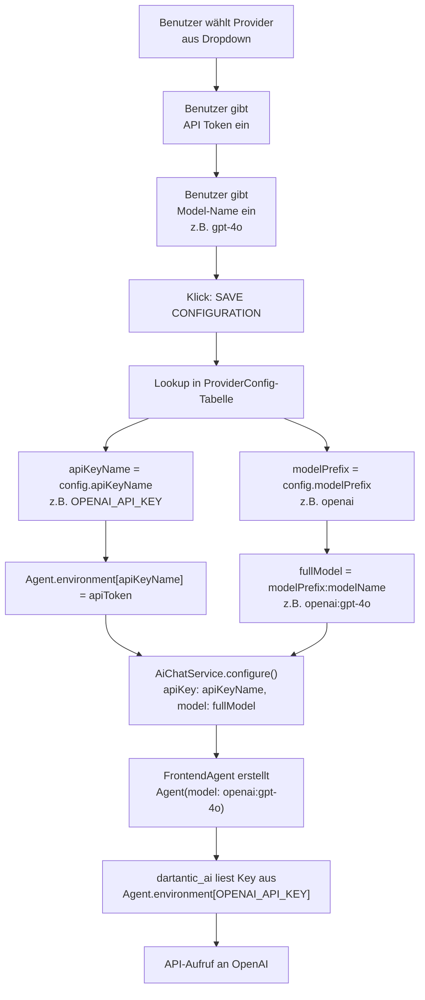

# Plan: Provider Configuration Migration

## Ziel

Die aktuelle API-Key-Konfiguration (Freitext-Eingabe des Environment-Variablen-Namens) soll durch eine **Dropdown-gesteuerte Provider-Auswahl** ersetzt werden. Der Benutzer wählt einen Provider aus einer vordefinierten Liste, und der Code leitet daraus den API-Key-Namen und das Model-Prefix ab.

---

## 1. Datenmodell: ProviderConfig-Tabelle

Eine zentrale Konfigurationstabelle wird in [`lib/main.dart`](lib/main.dart) definiert (z.B. als `List<ProviderConfig>` oder als Top-Level-Konstante).

| Modell-Prefix | Provider-Name (UI) | API-Key-Name |
|---|---|---|
| `openai` | `OpenAI` | `OPENAI_API_KEY` |
| `anthropic` | `Anthropic` | `ANTHROPIC_API_KEY` |
| `google` | `Google` | `GOOGLE_API_KEY` |
| `mistral` | `Mistral` | `MISTRAL_API_KEY` |
| `cohere` | `Cohere` | `COHERE_API_KEY` |
| `edenai` | `EdenAI` | `EDENAI_API_KEY` |
| `openrouter` | `OpenRouter` | `OPENROUTER_API_KEY` |
| `xai` | `xAI` | `XAI_API_KEY` |

**Vorschlag für die Datenklasse:**

```dart
class ProviderConfig {
  final String modelPrefix;   // z.B. "openai"
  final String providerName;  // z.B. "OpenAI"
  final String apiKeyName;    // z.B. "OPENAI_API_KEY"

  const ProviderConfig({
    required this.modelPrefix,
    required this.providerName,
    required this.apiKeyName,
  });
}

const providerConfigs = [
  ProviderConfig(modelPrefix: 'openai',    providerName: 'OpenAI',    apiKeyName: 'OPENAI_API_KEY'),
  ProviderConfig(modelPrefix: 'anthropic', providerName: 'Anthropic', apiKeyName: 'ANTHROPIC_API_KEY'),
  ProviderConfig(modelPrefix: 'google',    providerName: 'Google',    apiKeyName: 'GOOGLE_API_KEY'),
  ProviderConfig(modelPrefix: 'mistral',   providerName: 'Mistral',   apiKeyName: 'MISTRAL_API_KEY'),
  ProviderConfig(modelPrefix: 'cohere',    providerName: 'Cohere',    apiKeyName: 'COHERE_API_KEY'),
  ProviderConfig(modelPrefix: 'edenai',    providerName: 'EdenAI',    apiKeyName: 'EDENAI_API_KEY'),
  ProviderConfig(modelPrefix: 'openrouter',providerName: 'OpenRouter',apiKeyName: 'OPENROUTER_API_KEY'),
  ProviderConfig(modelPrefix: 'xai',       providerName: 'xAI',       apiKeyName: 'XAI_API_KEY'),
];
```

---

## 2. Änderungen in [`lib/src/osci_settings_panel.dart`](lib/src/osci_settings_panel.dart)

### 2.1 SettingsPanelCallbacks.onSave Signatur ändern

**Aktuell:**
```dart
final void Function(String ip, String key, String token, String model) onSave;
//                       ^^^^^^^^  env-var-name
```

**Neu:**
```dart
final void Function(String ip, String provider, String token, String model) onSave;
//                       ^^^^^^^^  provider-name (z.B. "OpenAI")
```

### 2.2 SettingsPanel neue Parameter

Hinzufügen:
```dart
final List<String> providerNames;      // Aus der Config-Tabelle extrahiert
final String selectedProvider;         // Aktuell ausgewählter Provider
```

### 2.3 UI-Änderung: API Key Name → Provider Dropdown

**Aktuell** (Zeile 167-171):
```dart
_buildSettingsField(
  _aiApiKeyController,
  'AI API Key Name',
  hint: 'e.g. OPENAI_API_KEY',
),
```

**Neu:** Ein `DropdownButtonFormField<String>` (oder `DropdownMenu`) mit den Provider-Namen:
```dart
// State-Feld:
String? _selectedProvider;

// initState:
_selectedProvider = widget.selectedProvider.isNotEmpty
    ? widget.selectedProvider
    : null;

// Im Build:
DropdownButtonFormField<String>(
  value: _selectedProvider,
  decoration: ...,
  hint: Text('Select AI Provider'),
  items: widget.providerNames.map((name) =>
    DropdownMenuItem(value: name, child: Text(name))
  ).toList(),
  onChanged: (v) => setState(() => _selectedProvider = v),
)
```

### 2.4 Save-Button Änderung

**Aktuell:**
```dart
onPressed: () => widget.callbacks.onSave(
  _ipController.text,
  _aiApiKeyController.text,    // <-- alter env-var-name
  _aiApiTokenController.text,
  _llmModelController.text,
),
```

**Neu:**
```dart
onPressed: () => widget.callbacks.onSave(
  _ipController.text,
  _selectedProvider ?? '',     // <-- provider-name
  _aiApiTokenController.text,
  _llmModelController.text,
),
```

Der `_aiApiKeyController` und die zugehörigen `initState`/`dispose`-Aufrufe können entfernt werden.

---

## 3. Änderungen in [`lib/main.dart`](lib/main.dart)

### 3.1 State-Felder

**Aktuell:**
```dart
String _aiApiKey = '';
String _aiApiToken = '';
String _llmModel = '';
```

**Neu:**
```dart
String _aiProvider = '';       // Provider-Name, z.B. "OpenAI" (ersetzt _aiApiKey)
String _aiApiToken = '';
String _llmModel = '';
```

### 3.2 `_isAiEnabled` Getter

**Aktuell:**
```dart
bool get _isAiEnabled =>
    _aiApiKey.trim().length >= 8 &&
    _aiApiToken.trim().length >= 8;
```

**Neu:**
```dart
bool get _isAiEnabled =>
    _aiProvider.isNotEmpty &&
    _aiApiToken.trim().length >= 8;
```

Nur noch prüfen: Provider ist ausgewählt + Token ist gesetzt.

### 3.3 `_loadConfig()` / `_saveConfig()`

**Aktuell:**
```dart
// Load
_aiApiKey = prefs.getString('ai_api_key') ?? '';

// Save
await prefs.setString('ai_api_key', _aiApiKey);
```

**Neu:**
```dart
// Load
_aiProvider = prefs.getString('ai_provider') ?? '';

// Save
await prefs.setString('ai_provider', _aiProvider);
```

Der alte `ai_api_key`-Key in SharedPreferences kann bestehen bleiben (wird ignoriert) oder gelöscht werden. Optional kann eine Migration geschrieben werden.

### 3.4 SettingsPanel-Instanziierung

Parameterliste erweitern:
```dart
SettingsPanel(
  ...
  providerNames: providerConfigs.map((c) => c.providerName).toList(),
  selectedProvider: _aiProvider,
  ...
)
```

### 3.5 `_configureAiService()` – Der Kern der Änderung

**Aktuell:**
```dart
void _configureAiService() {
  if (_aiApiKey.trim().length < 8 || _aiApiToken.trim().length < 8) return;

  _aiChatService.configure(
    apiKey: _aiApiKey,         // env-var-name
    apiToken: _aiApiToken,
    model: _llmModel.isNotEmpty ? _llmModel : 'deepseek:deepseek-v4-flash',
    vxi11Host: _ipAddress,
  );
}
```

**Neu:**
```dart
void _configureAiService() {
  if (_aiProvider.isEmpty || _aiApiToken.trim().length < 8) return;

  // Provider-Konfiguration aus der Tabelle suchen
  final config = providerConfigs.firstWhere(
    (c) => c.providerName == _aiProvider,
    orElse: () => ProviderConfig(
      modelPrefix: _aiProvider.toLowerCase(),
      providerName: _aiProvider,
      apiKeyName: '${_aiProvider.toUpperCase()}_API_KEY',
    ),
  );

  // API Key Name + Model-Prefix aus der Tabelle
  final apiKeyName = config.apiKeyName;     // z.B. "OPENAI_API_KEY"
  final modelPrefix = config.modelPrefix;   // z.B. "openai"

  // Model-String zusammensetzen: "openai:gpt-4o"
  final modelName = _llmModel.isNotEmpty ? _llmModel : 'gpt-4o';
  final fullModel = '$modelPrefix:$modelName';

  _aiChatService.configure(
    apiKey: apiKeyName,
    apiToken: _aiApiToken,
    model: fullModel,
    vxi11Host: _ipAddress,
  );
}
```

### 3.6 Speichern-Logik im Settings-Callback

**Aktuell:**
```dart
callbacks: SettingsPanelCallbacks(
  onSave: (newIp, newKey, newToken, newModel) {
    bool criticalConfigChanged =
        _ipAddress != newIp ||
        _aiApiKey != newKey ||
        _aiApiToken != newToken ||
        _llmModel != newModel;

    setState(() {
      _ipAddress = newIp;
      _aiApiKey = newKey;
      _aiApiToken = newToken;
      _llmModel = newModel;
      ...
    });
    ...
    if (_aiApiKey.trim().length >= 8 && _aiApiToken.trim().length >= 8) {
      _configureAiService();
    }
  },
  ...
)
```

**Neu:**
```dart
callbacks: SettingsPanelCallbacks(
  onSave: (newIp, newProvider, newToken, newModel) {
    bool criticalConfigChanged =
        _ipAddress != newIp ||
        _aiProvider != newProvider ||
        _aiApiToken != newToken ||
        _llmModel != newModel;

    setState(() {
      _ipAddress = newIp;
      _aiProvider = newProvider;
      _aiApiToken = newToken;
      _llmModel = newModel;
      ...
    });
    ...
    if (_aiProvider.isNotEmpty && _aiApiToken.trim().length >= 8) {
      _configureAiService();
    }
  },
  ...
)
```

---

## 4. Keine Änderungen in anderen Dateien

- [`lib/ai_chat_service.dart`](lib/ai_chat_service.dart) – Erwartet bereits `apiKey` (env-var-name) und `apiToken`. Keine Änderung nötig.
- [`lib/src/frontend_agent.dart`](lib/src/frontend_agent.dart) – Erwartet bereits model in `prefix:name`-Format. Keine Änderung nötig.
- [`lib/src/agent.dart`](lib/src/agent.dart) – Keine Änderung nötig.
- [`lib/dartanticai.dart`](lib/dartanticai.dart) – Keine Änderung nötig.

---

## 5. Ablauf-Diagramm



---

## 6. Zusammenfassung der Datei-Änderungen

| Datei | Änderung |
|---|---|
| [`lib/main.dart`](lib/main.dart) | + `ProviderConfig`-Klasse + Konfigurationstabelle<br>+ `_aiProvider` statt `_aiApiKey`<br>+ Geänderte `_loadConfig/_saveConfig` (Key: `ai_provider`)<br>+ Geänderte `_configureAiService()` (Lookup + Mapping)<br>+ Geänderter SettingsPanel-Callback |
| [`lib/src/osci_settings_panel.dart`](lib/src/osci_settings_panel.dart) | + `providerNames` + `selectedProvider`-Parameter<br>+ Dropdown statt TextField für Provider<br>+ Entfernen von `_aiApiKeyController`<br>+ Geänderte `onSave`-Signatur |
| Alle anderen Dateien | **Keine Änderungen** |
